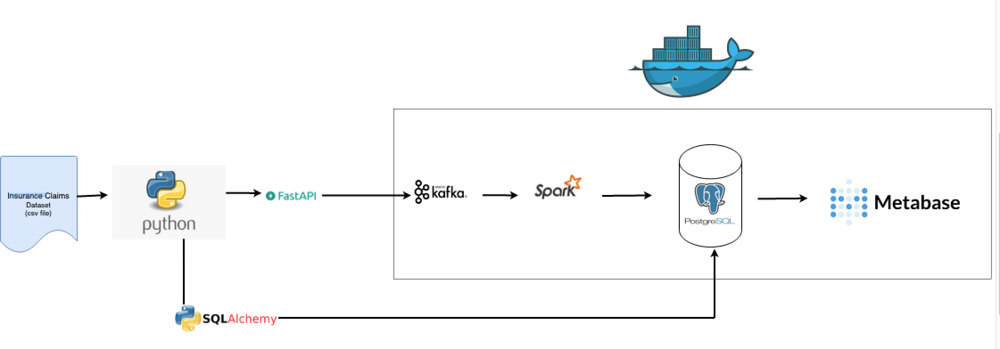
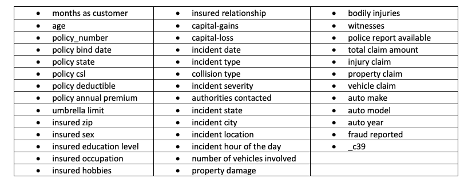
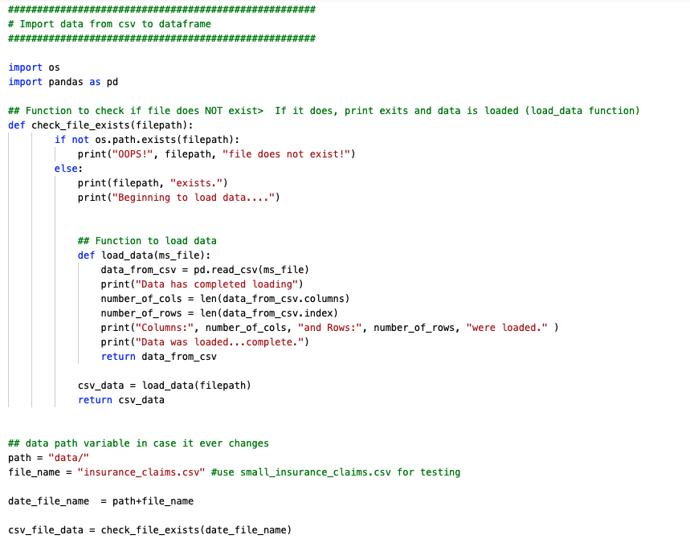
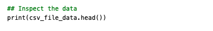
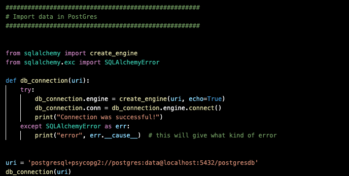
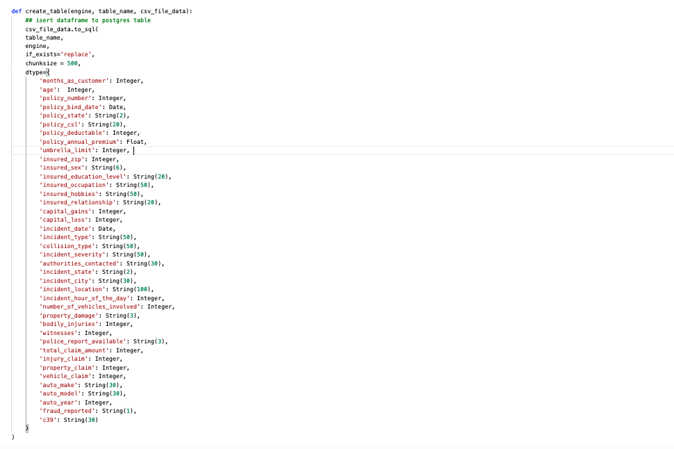
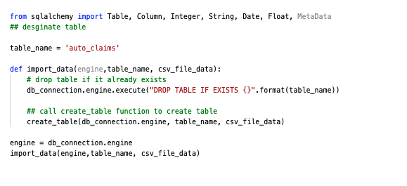

# How I used Kafka, Spark, Postgres, and Metabase in a Docker container to create a data engineering platform for auto insurance claims

# Introduction & Goals
Last year I completed a 
<a href="https://georgeanndata.github.io/2021/08/01/insurance_fraud_detection.html">data science project</a> where I used Python, Pandas and Tableau to better predict auto insurance fraud claims. After completing the project, I wondered if it would be more helpful for a data scientist to be able access the data without having to import the csv file uisng Python and how much better it would be for them to be working on the most updated data available, instead of a file they had stored locally, which in all probability was not current.  Since I have an ETL and data quality background, I decided to take  a data engineering program so I could create a platform that would conveniently supply the most updated auto insurance fraud data to the data scientist, making their jobs not only easier but also improving their analysis and reporting.  

__Links to programs__:
* <a href="https://data-science-infinity.teachable.com/">Data Science Infinity</a>
* <a href="https://learndataengineering.com">Data Engineering Academy</a>

__Architecture__

For this project I have taken an auto claims data csv file and ingested it into the Postgres database in two ways.  

1. The first way was stream it as an API message into Apache Kafka for buffering to Apache Spark for processing and Postgres for storing. 
2. The second way was by using Python and SQLAlchemy to bulk import the data into Postgres.

The reason I used two ways was so there was a primary process (__<em>streaming</em>__) and a backup process (__<em>bulk import</em>__). 

Once the data was stored in the Postgres database, I configured Metabase (located in same Docker Container) as the visulaization tool that business users could use to report on and analyze the data.

# Contents

- [The Data Set](#the-data-set)
- [Used Tools](#used-tools)
  - [Connect](#connect)
  - [Buffer](#buffer)
  - [Processing](#processing)
  - [Storage](#storage)
  - [Visualization](#visualization)
- [Pipelines](#pipelines)
  - [Stream Processing](#stream-processing)
    - [Storing Data Stream](#storing-data-stream)
    - [Processing Data Stream](#processing-data-stream)
  - [Batch Processing](#batch-processing)
  - [Visualizations](#visualizations)
- [Demo](#demo)
- [Conclusion](#conclusion)
- [Follow Me On](#follow-me-on)
- [Appendix](#appendix)

# The Data Set

I used the same [auto insurance fraud dataset](data/insurance_claims.csv) that I used from my data science project.  

The dataset contains 40 attributes for 1,000 auto insurance claims, 247 that were labeled as fraudulent and 753 that were labeled as non-fraudulent. 

# Used Tools

The tools I used for this project included:

* Python
* SQLAlchemy
* FastAPI
* Apache Kafka
* Apache Spark
* Postgres
* Metabase 
* Docker container for above tools 

## Connect

Using Python, I created a function that checks that the file csv exists and if so, loads it into a Pandas dataframe. If it doesn't exist, it will throw an error. 

After importing, inspect the dataframe for anything strange. 

In order to create the table in Postgres using SQLAlchemy, column names cannot contain certain extended characters  (*, ! and -.) and also cannot start with _, even though _ is an allowable extended character. Using Python I checked that the column names adhered to this requirement and if they did not to update them accordingly.

For the bulk importing, I took the dataframe and using Python and SQLAcademy, bulk imported it into the Postgres database. 

 Since I will be ingesting the data in two ways, one via a bulk import dumb to Postgres

For the streaming, I used Python to convert the csv file to a JSON file. 

## Buffer
Apache Kafka
## Processing
Apache Spark
## Storage
PostGres
## Visualization
Metabase

# Pipelines
- Explain the pipelines for processing that you are building
- Go through your development and add your source code

## Stream Processing
### Storing Data Stream
### Processing Data Stream
## Batch Processing
## Visualizations

# Demo
- You could add a demo video here
- Or link to your presentation video of the project

# Conclusion
Write a comprehensive conclusion.
- How did this project turn out
- What major things have you learned
- What were the biggest challenges

# Follow Me On
Add the link to your LinkedIn Profile

# Appendix

[Markdown Cheat Sheet](https://github.com/adam-p/markdown-here/wiki/Markdown-Cheatsheet)