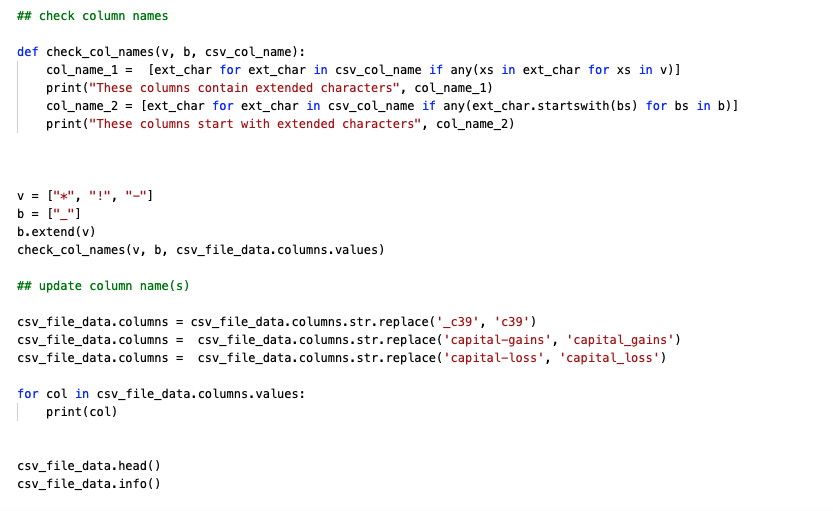
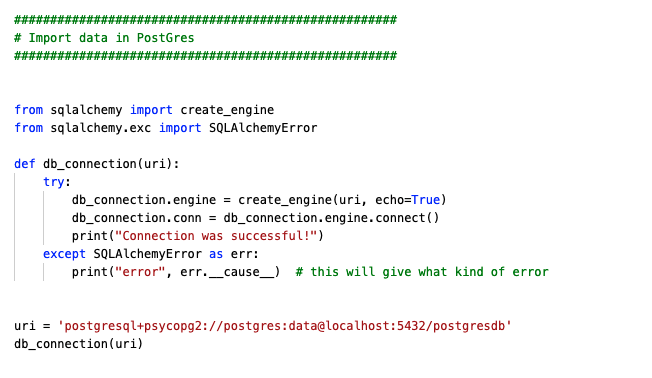

# How I used Kafka, Spark, Postgres, and Metabase in a Docker container to create a data engineering platform for auto insurance claims

# Introduction & Goals
Last year I completed a 
<a href="https://georgeanndata.github.io/2021/08/01/insurance_fraud_detection.html">data science project</a> where I used Python, Pandas and Tableau to better predict auto insurance fraud claims. After completing the project, I wondered if it would be more helpful for a data scientist to be able access the data without having to import the csv file using Python and how much better it would be for them to be working on the most updated data available, instead of a file they had stored locally, which in all probability was not current.  Since I have an ETL and data quality background, I decided to take a data engineering program so I could create a platform that would conveniently supply the most updated auto insurance fraud data to the data scientist, making their jobs not only easier but also improving their analysis and reporting.  

__Links to programs__:
* <a href="https://data-science-infinity.teachable.com/">Data Science Infinity</a>
* <a href="https://learndataengineering.com">Data Engineering Academy</a>

__Architecture__

Once the data was stored in the Postgres database, I configured Metabase (located in same Docker Container) as the visulaization tool that business users could use to report on and analyze the data.

# Contents

- [The Data Set](#the-data-set)
- [Used Tools](#used-tools)
  - [Connect](#connect)
  - [Buffer](#buffer)
  - [Processing](#processing)
  - [Storage](#storage)
  - [Visualization](#visualization)
- [Pipelines](#pipelines)
  - [Stream Processing](#stream-processing)
    - [Storing Data Stream](#storing-data-stream)
    - [Processing Data Stream](#processing-data-stream)
  - [Batch Processing](#batch-processing)
  - [Visualizations](#visualizations)
- [Conclusion](#conclusion)
- [Follow Me On](#follow-me-on)
- [Appendix](#appendix)

# The Data Set

I used the same [auto insurance fraud dataset](data/insurance_claims.csv) that I used from my data science project.  

The dataset contains 40 attributes for 1,000 auto insurance claims, 247 that were labeled as fraudulent and 753 that were labeled as non-fraudulent. 

# Used Tools

The tools I used for this project included:

* Python
* SQLAlchemy
* FastAPI
* Apache Kafka
* Apache Spark
* Postgres
* Metabase 
* Docker container for above tools 

## Connect

For this project I have taken an auto claims data CSV file and ingested it into the Postgres database in two ways.  

1. The first way was by streaming. I used Python to transform the CSV file to a JSON file in order to write it the API created with FastAPI.
2. The second way was by using Python and SQLAlchemy to bulk import the data into Postgres.

The reason I used two ways was so there was a primary process (__<em>streaming</em>__) and a backup process (__<em>bulk import</em>__). 

 

## Buffer

For the data that is streamed into the system as a message, I used Apache Kafka as a message queue.  As mentioned earlier, I put all the tools in a Docker container. 

In the docker-compose file, I used latest bitnami image for both the Zookeeper and Kafka services,  added them to the same network (__insurance-streaming__) and gave the Kafka service both an internal and external listeners; internal so services on the Docker container can communicate with Kafka and external so communication can be done outside of the Docker container, such when using Postman that is installed on a local client for testing APIs.

## Processing

For the processing of the data, I used Apache Spark. In the docker-compose file, I used the jupyter/pyspark-notebook:spark-2 image, a volume location where the Spark data will be presisted and added it to the same netork as the other services. 

## Storage

For storing the data, I used a PostGres database. The reason I chose Postgres is because it is not only a relational database but also a document store database. Choosing another database such as Oralce, which is only a relational database, or MongoDB, which is only a document store database, would require having to maintaining two seperate databases for the processes, instead of one.

In the docker-compose file I designated, postgres:12.9 for Postgres and dpage/pgadmin4 for PGAdmin as the images, a volume location where the Postgres data will be presisted and assigned it to the same network as the other services.

For security reasons, I used an environment file to hold the Postgres database name, Postgres user name and password, PGadmin email and PGadmin password.  

_*Ignored the postgres.env file for Github._

## Visualization

I used Metabase as the visualiation tool. I chose Metabase because it was open source, could be put in the Docker container and integrates well with PostGres. 

For its image I used metabase/metabase, a volume location where the Metabase data will be presisted and assigned it to the same network as the other services.

For security reasons, I used an environment file to hold the metabase database type, name, port, user name and password. Additionally, the metabase database host, encryption secret key, java timezone and port. 

_*Ignored the metabase_database.env file for Github._

# Pipelines

## Batch Processing

Using Python, I created a function that checks that the CSV file exists and if so, loads it into a Pandas dataframe. If it doesn't exist, it will throw an error. 

After importing the file, I inspected the dataframe, looking for anything strange. 

In order to create the table in Postgres using SQLAlchemy, column names cannot contain certain extended characters  (*, ! and -.) and cannot start with _, even though _ is an allowable extended character. Using Python I checked that the column names adhered to this requirement and if they did not to update them accordingly.

I then took the dataframe used SQLAcademy to  imported it into the Postgres database. 

## Stream Processing

### Storing Data Stream
### Processing Data Stream
## Batch Processing

## Visualizations

# Conclusion
Write a comprehensive conclusion.
- How did this project turn out
- What major things have you learned
- What were the biggest challenges

# Follow Me On
Add the link to your LinkedIn Profile

# Appendix

[Markdown Cheat Sheet](https://github.com/adam-p/markdown-here/wiki/Markdown-Cheatsheet)